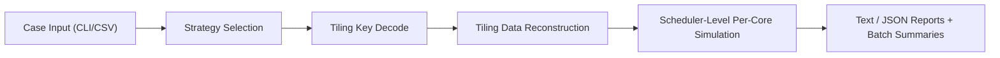

# MatMul Tiling Analyzer

[](https://github.com/YuXiang-ZhuanSun/ascend_matmul_tiling_analyzer/actions/workflows/ci.yml)
[](./LICENSE)
[](./pyproject.toml)
[](./docs/source_branch_mapping.md)

[Project Home](./README.md) | [中文 README](./README.zh-CN.md) | [Source Branch Mapping](./docs/source_branch_mapping.md) | [Strategy Handbook](./docs/ascend950_tiling_strategy.md) | [Example Outputs](./docs/example_outputs.md)


**Read tiling like source code. Diagnose performance like a kernel engineer.**

In `mat_mul_v3` optimization, the most expensive part is often not arithmetic itself but hidden decision paths:
which branch did this shape hit, is core splitting balanced, and are tail blocks silently consuming throughput.

`MatMul Tiling Analyzer` turns that uncertainty into verifiable evidence:
it replays strategy selection with source-level semantics, decodes `tiling_key` and `tiling_data`, and expands the result into per-core task workload views.

## About

`MatMul Tiling Analyzer` is a tiling analysis and diagnosis toolkit for **Ascend950 (DAV_3510) / MatMulV3**.
It does not replace runtime behavior and does not rely on heuristic guessing. Instead, it connects host-side branching, kernel dispatch, and scheduler behavior into one traceable chain for tuning diagnosis, regression review, and cross-team communication.

## Why It Matters

- Confirm branch correctness before entering long profiling loops.
- Quantify inter-core and intra-core partitioning quality beyond "it runs".
- Surface imbalance and utilization loss through per-core tasks and tail behavior.
- Produce reproducible, reviewable, automation-friendly analysis artifacts.

## What You Can Verify

- **Strategy selection**: `k_equal_zero`, `to_mul`, `basic_streamk`, `basic_aswt`
- **Branch details**: `streamk_sk` / `streamk_dpsk`, `basic_aswt_a_full_load` / `basic_aswt_b_full_load`
- **Key semantics**: field-level decoding of `tiling_key` (`api_level`, `model`, `full_load`, `l0c2out`, etc.)
- **Scheduling result**: inter-core split, intra-core blocks, per-core task lists
- **Exports**: per-case text/JSON plus batch `summary.csv` / `summary.json`

## Strategy Coverage (Current)

| Strategy | Typical condition in analyzer | Kernel implementation |
| --- | --- | --- |
| `k_equal_zero` | `k == 0` with no bias | `MatMulInputKEqZeroClearOutput` |
| `to_mul` | forced group acc + fp32 + (`m==1` or `n==1`) + `k>=512` | `MatMulToMulActKernel` |
| `basic_streamk` | `x1_format == ND` and Stream-K capability check passes | `MatMulStreamKActKernel` |
| `basic_aswt` | default fallback path (including full-load / fixpipe variants) | `MatMulActKernel` / `MatMulFixpipeOptiActKernel` |

## How It Works



## Quick Start

```powershell
python -m pip install -e .
python cli.py --input=cases/quickstart_cases.csv --output-dir=results/quickstart
```

Single-case analysis:

```powershell
python cli.py --m 2048 --k 4096 --n 256 --dtype bfloat16
```

You can also use the installed entrypoint:

```powershell
matmul-tiling-analyzer --m 2048 --k 4096 --n 256 --dtype bfloat16
```

Run tests:

```powershell
python -m pytest
```

## Output Artifacts

When `--output-dir` is provided, outputs are organized as:

```text
results/<run_name>/
  summary.csv
  summary.json
  cases/
    <testcase>.json
    <testcase>.txt
```

## Scope & Non-Goals

- Current focus: `mat_mul_v3` tiling analysis
- Current hardware scope in docs/examples: `Ascend950 (DAV_3510)`
- Positioning: analysis and diagnosis tool, not a runtime replacement

## Documentation

- [Project Home](./README.md)
- [README.zh-CN.md](./README.zh-CN.md)
- [Source Branch Mapping](./docs/source_branch_mapping.md)
- [Ascend950 Tiling Strategy](./docs/ascend950_tiling_strategy.md)
- [Example Outputs](./docs/example_outputs.md)
- [Release Notes v0.1.0](./docs/release_notes_v0.1.0.md)
- [Contributing](./CONTRIBUTING.md)
- [Code of Conduct](./CODE_OF_CONDUCT.md)
- [Changelog](./CHANGELOG.md)

## License

This project is licensed under [MIT](./LICENSE).
