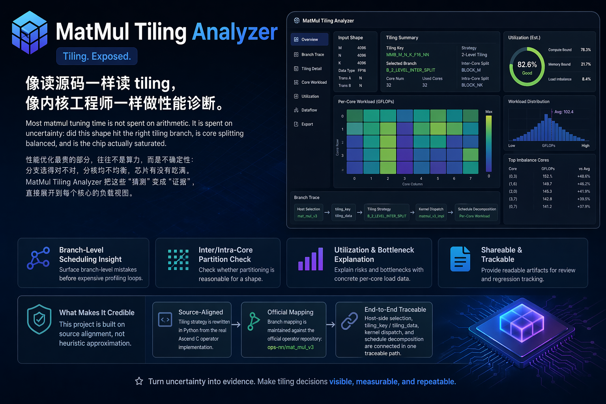

# MatMul Tiling Analyzer

[](https://github.com/YuXiang-ZhuanSun/ascend_matmul_tiling_analyzer/actions/workflows/ci.yml)
[](./LICENSE)
[](./pyproject.toml)
[](./docs/source_branch_mapping.md)

[中文 README](./README.zh-CN.md) | [English README](./README.en.md)



**Tiling. Exposed.**

**像读源码一样读 tiling，像内核工程师一样做性能诊断。**

Most matmul tuning time is not spent on arithmetic. It is spent on uncertainty: did this shape hit the right tiling branch, is core splitting balanced, and is the chip actually saturated.  
`MatMul Tiling Analyzer` turns that uncertainty into evidence by replaying real `mat_mul_v3` tiling logic and expanding it into per-core workload views.

性能优化最贵的部分，往往不是算力，而是不确定性：分支选得对不对，分核均不均衡，芯片有没有吃满。  
`MatMul Tiling Analyzer` 把这些“猜测”变成“证据”，直接展开到每个核心的负载视图。

## Why This Project

- Surface branch-level scheduling mistakes before expensive profiling loops.
- Check whether inter-core and intra-core partitioning is reasonable for a shape.
- Explain utilization risks and bottlenecks with concrete per-core load data.
- Provide a shared, readable artifact for performance review and regression tracking.

## What Makes It Credible

This project is built on **source alignment**, not heuristic approximation.

- Tiling strategy is rewritten in Python from the real Ascend C operator implementation.
- Branch mapping is maintained against the official operator repository: [`ops-nn/mat_mul_v3`](https://gitcode.com/cann/ops-nn/tree/master/matmul/mat_mul_v3)
- Host-side selection, `tiling_key` / `tiling_data`, kernel dispatch, and schedule decomposition are connected in one traceable path.

## What You Get

For each case:

- selected strategy and source-mapped branch
- decoded `tiling_key` and key fields
- relevant `tiling_data` payload
- inter-core split and intra-core block plan
- per-core workload summary and kernel task layout

For batch runs:

- `summary.json`
- `summary.csv`
- `cases/<testcase>.json`
- `cases/<testcase>.txt`

## Quick Start

```powershell
python -m pip install -e .
python cli.py --input=cases/quickstart_cases.csv --output-dir=results/quickstart
```

Launch the local panel:

```powershell
matmul-tiling-panel
```

The panel runs in a browser on Windows, macOS, and Linux. It supports manual shape input, CSV testcase upload, selected branch inspection, `tiling_key` decoding, and 32-core workload drill-down.

Single case:

```powershell
python cli.py --m 2048 --k 4096 --n 256 --dtype bfloat16
```

Run tests:

```powershell
python -m pytest
```

## Scope

- Current implementation focus: `mat_mul_v3`
- Current hardware scope in strategy docs/examples: `Ascend950 (DAV_3510)`
- Positioning: analysis and diagnosis tool, not runtime replacement

## Documentation

- [README.zh-CN.md](./README.zh-CN.md)
- [README.en.md](./README.en.md)
- [Source Branch Mapping](./docs/source_branch_mapping.md)
- [Ascend950 Tiling Strategy](./docs/ascend950_tiling_strategy.md)
- [Local Panel](./docs/panel.md)
- [Example Outputs](./docs/example_outputs.md)
- [Release Notes v0.1.0](./docs/release_notes_v0.1.0.md)
- [Contributing](./CONTRIBUTING.md)
- [Code of Conduct](./CODE_OF_CONDUCT.md)
- [Changelog](./CHANGELOG.md)

## License

This project is licensed under [MIT](./LICENSE).
